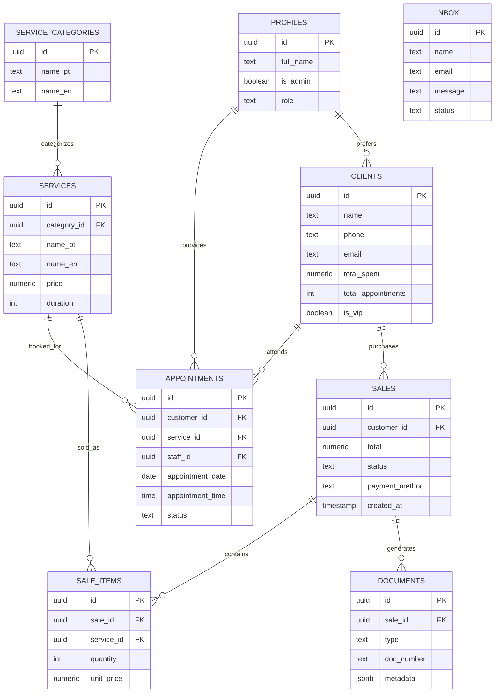

# 📊 Serena Glow Database Schema

This document provides a visual representation of the Serena Glow database architecture.

## Entity Relationship Diagram (ERD)

## Description of Key Relationships

- **Appointments**: The core junction between Clients, Services, and Staff (Profiles). It tracks time and status.
- **Sales & Items**: Sales record financial transactions, while Sale Items track the specific Services provided in each transaction.
- **Documents**: Linking to Sales to provide Proof of Sale (Receipts/Invoices).
- **Profiles**: Extended user data synced with Auth records, managing roles and permissions.

---
*Created automatically by Antigravity Orchestrator.*
